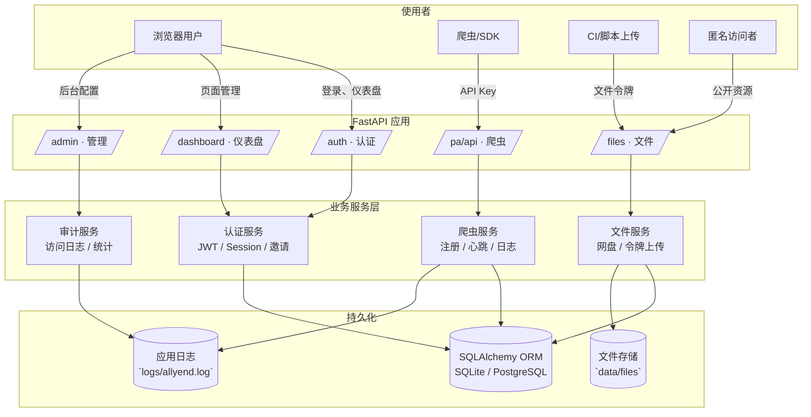

# AllYend

AllYend 是一个集爬虫调度监控、文件中转与访问审计于一体的协作平台，目标是让数据团队用一套后端即可完成“采集→同步→分发”的全流程，并兼顾权限、安全与观测性。

## 为什么选择 AllYend

- **统一入口**：FastAPI 单体应用承载账户、爬虫、文件三个域，省去拆分多套服务的运维成本。
- **安全托底**：支持登录态、邀请码、API Key、文件令牌、IP/CIDR 白名单与访问日志，方便界定责任边界。
- **开发友好**：SQLAlchemy + Pydantic 的数据层易于扩展；Jinja2 模板与原生 JS 静态资源便于二次开发。
- **自动审计**：系统内置 `file_access_logs`、`crawler_runs` 等流水记录，可快速定位“谁在何时做了什么”。

## 系统架构



### 架构解读

- **分层明确**：路由层只负责请求编排；核心逻辑集中在业务服务函数，便于单测与重用；数据落地在 ORM 模型中。
- **无锁扩展**：文件落地在对象目录 `data/files/objects`，配合令牌可实现无账号上传；未来可替换为 S3/OSS。
- **观测闭环**：所有令牌上传、下载与爬虫事件都会写入数据库日志表，并同步到本地日志文件，方便交叉排查。

## 快速启动

1. **准备配置**
   ```bash
   copy .env.example .env   # Linux/macOS 使用 cp
   ```
   - 调整 `SECRET_KEY`、`ROOT_ADMIN_PASSWORD`、`DATABASE_URL` 与 `FILE_STORAGE_DIR`。
   - 首次启动会依据 `ROOT_ADMIN_INVITE_CODE` 生成超级管理员账号。

2. **安装依赖**（推荐使用 [uv](https://github.com/astral-sh/uv)）
   ```bash
   python -m pip install -U uv
   uv venv
   uv sync
   ```

3. **运行开发服务**
   ```bash
   uv run uvicorn app.main:app --reload --host 0.0.0.0 --port 9093
   ```

4. **体验入口**
   - 浏览器访问 `http://localhost:9093`
   - 使用 `.env` 中的超级管理员登录，进入 `/admin` 生成邀请码或调整注册策略
   - `/files` 页面可管理个人文件、生成令牌并查看上传历史

> 生产部署建议加上反向代理（Nginx/Caddy）、开启 HTTPS、启用系统服务或容器守护，并定期备份数据库与文件目录。

## 核心目录一览

| 目录/文件 | 说明 |
| -------- | ---- |
| `app/main.py` | FastAPI 应用入口，注册路由、异常处理与日志配置 |
| `app/config.py` | Pydantic 设置对象，统一加载 `.env` 与默认值 |
| `app/models.py` | SQLAlchemy ORM 模型定义（用户、令牌、文件、爬虫等） |
| `app/routers/` | 路由模块（认证 `auth.py`、文件 `files.py`、爬虫 `crawlers.py` 等） |
| `app/templates/` | Jinja2 模板，包含后台 UI、文件页、公共视图 |
| `app/utils/` | 通用工具（时间、加密、分页、校验） |
| `sdk/crawler_client.py` | Python SDK，封装爬虫注册、心跳、日志上报 |
| `logs/` | 默认日志输出目录（可在 `.env` 中调整） |

## 文件服务工作流

1. **生成令牌**（登录用户）
   - `POST /files/tokens`：可自定义后缀（未加 `up-` 时自动补齐）、名称与 IP/CIDR 白名单。
   - `GET /files/tokens`：查看当前用户的全部令牌。
   - `PATCH /files/tokens/{token_id}`：启用/禁用或修改描述、白名单。

2. **通过令牌上传**
   - `POST /files/{token}/up`
   - 请求体必须是 `multipart/form-data`，至少包含 `file` 字段，支持可选的 `file_name`、`visibility`（`private`/`group`/`public`/`disabled`）与 `description`。
   - 令牌会验证 `up-` 前缀、启用状态、IP/IP 段限制，并在成功后写入访问日志。

3. **令牌侧查询**
   - `GET /files/{token}` 返回该令牌所属用户下的文件列表（JSON），常用于 CI/脚本同步。
   - `download=true`：若参数 `?download=1` 出现则强制以文件下载方式处理，解决文件名与令牌相同的边界场景。

4. **公开文件下载**
   - 访问 `/files/<别名>` 会根据文件名去重规则取最新一版，并校验可见性与登录状态。
   - 若别名以 `up-` 开头且你想强制下载，可访问 `/files/<别名>?download=1`。

5. **操作审计**
   - 每一次上传、下载、令牌查询都会写入 `file_access_logs`，可在 `/files/manage` 或 `/admin` 中查看。

### 令牌踩坑提示

- 令牌统一格式为 `up-自定义后缀`，便于在路由层快速区分。
- IP 白名单字段支持逗号分隔；CIDR 字段支持 `10.0.0.0/24` 等写法，可混合使用。
- 兼容历史：原 `/files/api/tokens/**` 路径已经废弃，请更新客户端到新的 `/files/**` 路由。

## API 参考

### 认证与用户

| 方法 | 路径 | 说明 |
| ---- | ---- | ---- |
| `POST` | `/auth/login` | 表单登录，返回会话 Cookie |
| `POST` | `/auth/logout` | 注销当前会话 |
| `POST` | `/auth/register` | 根据配置决定是否需要邀请码 |
| `GET` | `/dashboard` | 登录后主页（Jinja 页面） |

### 文件与令牌

| 方法 | 路径 | 请求体/参数 | 返回 |
| ---- | ---- | ---- | ---- |
| `POST` | `/files/me/up` | `multipart/form-data`，字段同令牌上传 | `FileUploadResponse` |
| `POST` | `/files/{token}/up` | `file`（必填） + 可选字段 | `FileUploadResponse` |
| `GET` | `/files/{token}` | 可选 `download=1` | JSON 文件列表或文件下载 |
| `GET` | `/files` | 页面，列出可访问文件 |
| `POST` | `/files/tokens` | JSON，`token`/`name`/`allowed_ips`/`allowed_cidrs` | `FileTokenOut` |
| `GET` | `/files/tokens` | — | `list[FileTokenOut]` |
| `PATCH` | `/files/tokens/{token_id}` | `FormData`（支持布尔和文本字段） | `FileTokenOut` |
| `GET` | `/files/api/logs` | `limit`（默认 200） | `list[FileAccessLogOut]` |

### 爬虫接入（节选）

| 方法 | 路径 | 简述 |
| ---- | ---- | ---- |
| `POST` | `/pa/api/register` | 注册爬虫并获取 ID 与 API Key |
| `POST` | `/pa/api/{crawler_id}/heartbeat` | 上报心跳时间戳 |
| `POST` | `/pa/api/{crawler_id}/logs` | 推送运行日志 |
| `GET` | `/pa/api/me` | 查看属于自己的爬虫列表 |
| `POST` | `/pa/api/links` | 创建匿名访问链接 |

更多细节请结合源码 `app/routers/crawlers.py` 与 SDK 文档。

## 变更记录（重点）

- **2025-09**：
  - 文件令牌路由全面迁移到 `/files` 前缀：
    - 上传：`POST /files/{token}/up`
    - 查询：`GET /files/{token}`
    - 管理：`POST /files/tokens`、`GET /files/tokens`、`PATCH /files/tokens/{token_id}`
  - 新增 `download=1` 查询参数以兼容与令牌同名的文件下载。
  - README 与前端管理页同步更新指引。

## 运维与安全建议

- **账号安全**：
  - 启用强密码策略，定期更新超级管理员密码。
  - 对外开放时建议关闭“任何人注册”，仅使用邀请码或手动创建。
- **文件安全**：
  - 为重要令牌设置 IP/IP 段限制，必要时定期轮换。
  - 结合对象存储使用时，可将 `FILE_STORAGE_DIR` 指向挂载目录或使用自定义后端。
- **日志留存**：
  - `logs/allyend.log` 建议配合 logrotate 或发送到集中式日志平台。
  - 数据库中的 `file_access_logs`、`crawler_runs` 可定期归档。
- **监控扩展**：
  - 可通过 Uvicorn/Starlette 自带指标或使用 Prometheus 客户端采集接口耗时、请求量。

## 开发与测试

1. **代码格式**：项目使用 `ruff`、`black` 配置在 `pyproject.toml` 中，可按需启用。
2. **单元测试**：
   ```bash
   uv run pytest
   ```
   - 默认使用内存 SQLite，测试过程中会创建临时文件夹。
   - 若自定义 `FILE_STORAGE_DIR`，请确保测试有写权限。
3. **前端开发**：模板在 `app/templates`，样式集中在 `app/static/styles.css`，无需构建流程即可热更新。
4. **调试技巧**：
   - 设置 `LOG_LEVEL=DEBUG` 以查看更多请求轨迹。
   - 使用 `uvicorn --reload` 搭配 `watchgod` 实时刷新。

## 常见问题速览

- **上传 422 错误**：检查是否使用了 `file` 字段。若旧脚本仍传 `upload`，请更新字段名。
- **令牌 403**：确认令牌启用状态、IP/IP 段限制；同时校验是否仍保留 `up-` 前缀。
- **下载返回 JSON**：说明路径被识别为令牌列表，可在 URL 追加 `?download=1` 强制走文件分支。
- **文件名重复**：系统会按上传顺序追加 `-1/-2` 等后缀，可通过 `/files` 页面查看实际访问别名。

---

欢迎通过 Issue、PR 或讨论区贡献想法，让 AllYend 在数据协作场景下更稳定、更好用。
