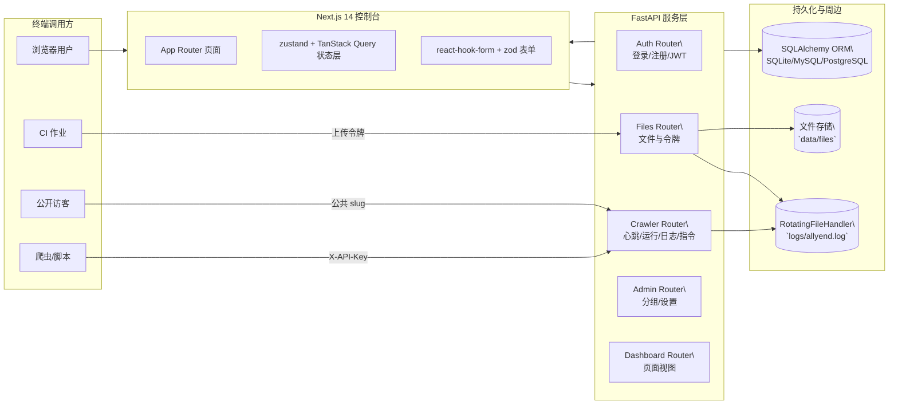
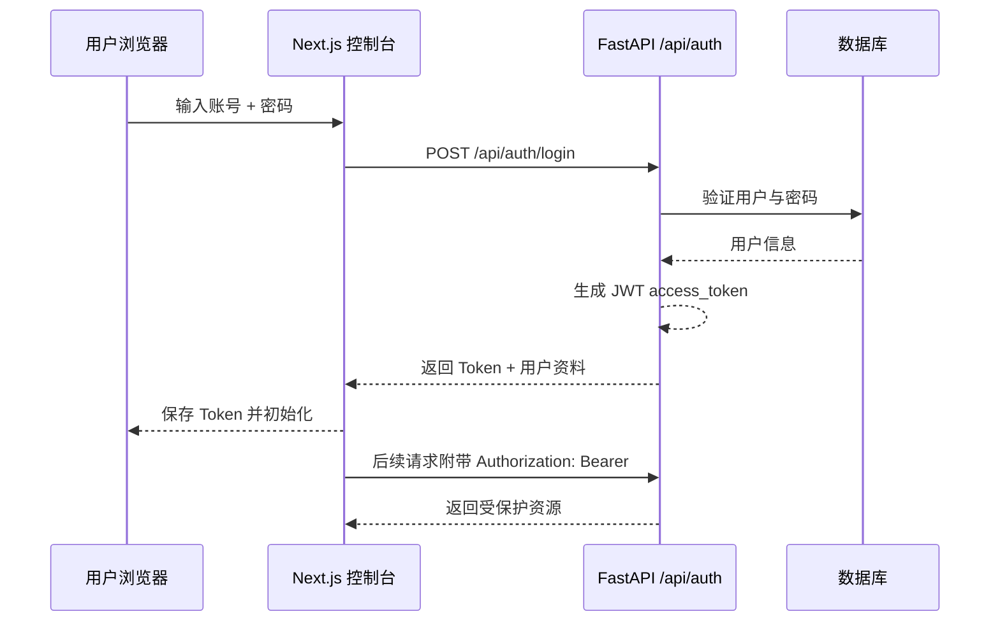
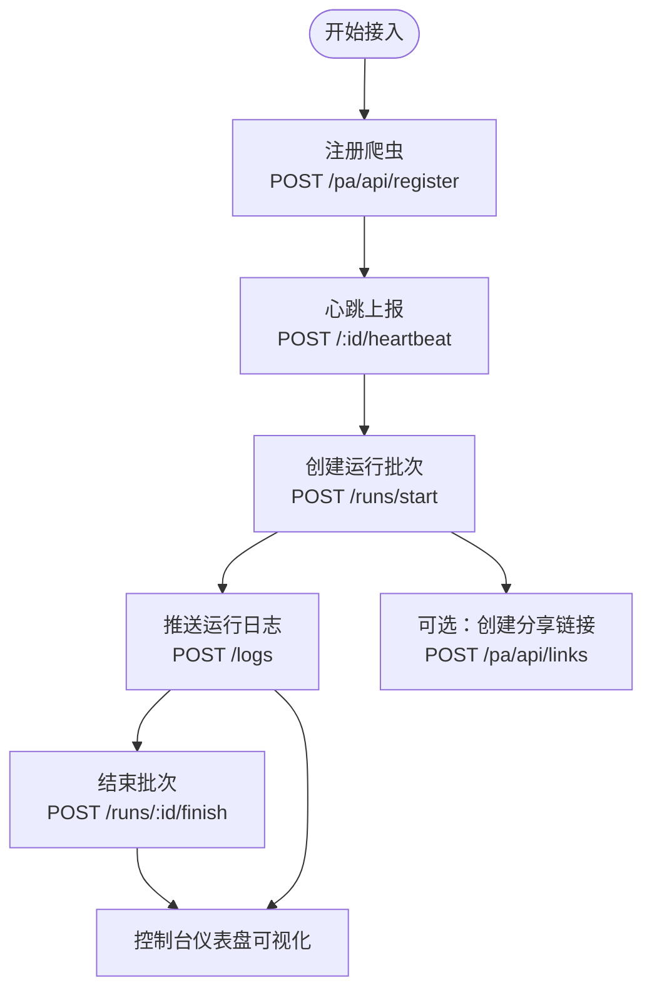
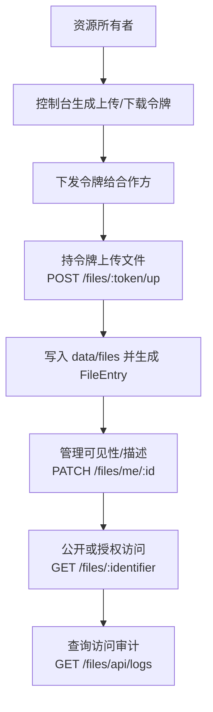
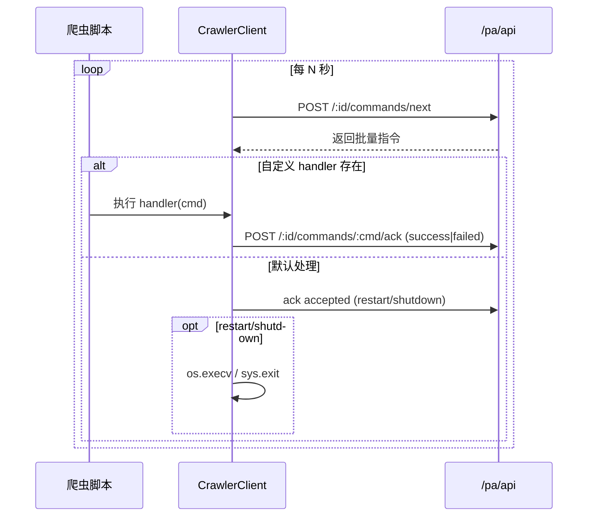

# AllYend 平台

> 一站式“采集资产 + 文件协作 + 团队治理 + 审计可观测”平台。后端基于 FastAPI/SQLAlchemy/Alembic，前端采用 Next.js 14。

**为什么选择 AllYend**
- 面向采集/自动化团队：统一管理爬虫实例、运行批次、日志与远程指令
- 安全的文件中转：上传令牌、私有/分组/公开可见、访问审计与下载统计
- 轻量治理：邀请码注册、分组开关、管理员面板、主题偏好
- 工程友好：Alembic 迁移、日志轮转、Docker Compose + Nginx 一键上线

**核心能力**
- 爬虫接入与监控：注册、心跳、运行、日志、远程指令、公共链接
- 文件服务：令牌上传、重名别名下载、可见性与权限校验、全量访问日志
- 团队与权限：用户/分组/角色（user/admin/superadmin）、注册模式（开放/邀请码/关闭）

**技术栈**
- 前端：Next.js 14、TypeScript、Tailwind、shadcn/ui、TanStack Query
- 后端：FastAPI、Pydantic v2、SQLAlchemy 2、Alembic、Uvicorn、Jinja2
- 存储：SQLite 默认（兼容 MySQL/PostgreSQL）、本地文件系统，轮转日志到 `logs/`

## 目录

- [10 分钟上手（本地）](#10-分钟上手本地)
- [一键容器化](#一键容器化)
- [架构要点一览](#架构要点一览)
- [架构与蓝图](#架构与蓝图)
- [业务流程与时序图](#业务流程与时序图)
- [配置清单](#配置清单)
- [SDK 快速用法](#sdk-快速用法)
- [常用命令](#常用命令)
- [部署与运维](#部署与运维)
- [质量与安全建议](#质量与安全建议)

## 10 分钟上手（本地）

1) 准备依赖：Python ≥ 3.12、Node.js 22.x、pnpm 9.x、uv
2) 复制配置：`.env` 与 `frontend/.env`（按需修改数据库/站点参数）
3) 启动后端
   - `uv venv && uv sync`
   - `uv run uvicorn app.main:get_app --reload --port 9093`
4) 启动前端
   - `cd frontend && pnpm i && pnpm dev`
5) 访问控制台：`http://localhost:3000`

提示：初次启动会自动执行数据库迁移与默认数据自举（用户组/邀请码/超级管理员）。

## 一键容器化

- `docker compose up -d --build`
- 默认入口：`http://localhost:8080`（前端），反代 `/api` → 后端 `9093`

## 架构要点一览

- 统一 API 前缀：业务 `/api`、爬虫 `/pa/api`、文件 `/files/*`、公共页 `/pa/:slug`
- 启动钩子：自动 `alembic upgrade head` + 默认数据 `bootstrap_defaults()`
- 日志：应用日志写入 `logs/allyend.log`（RotatingFileHandler），数据库层面保留访问/操作留痕
- CORS：`FRONTEND_ORIGINS` 支持逗号分隔或 JSON 数组

## 典型使用场景

- 团队管理多套采集脚本，统一查看“在线/告警/日志”，并下发远程指令
- 与外部协作方进行文件中转，令牌限 IP/CIDR，所有访问全留痕
- 在企业内部低成本搭建轻量协作平台，逐步扩展到多租户/细粒度权限

## 架构与蓝图



## 业务流程与时序图

### 登录与授权



### 爬虫接入生命周期



### 文件令牌与访问闭环



### 远程指令轮询（SDK 默认处理）



## 配置清单

- 基础
  - `DATABASE_URL`：默认 `sqlite:///./data/app.db`
  - `SECRET_KEY`：JWT 签名密钥（务必修改）
  - `ACCESS_TOKEN_EXPIRE_MINUTES`：Token 过期分钟数（默认 120）
  - `HOST`/`PORT`：监听地址与端口（默认 `0.0.0.0:9093`）
- 注册与邀请
  - `ALLOW_DIRECT_SIGNUP`：是否允许自由注册（默认 true）
  - `ROOT_ADMIN_USERNAME`、`ROOT_ADMIN_PASSWORD`、`ROOT_ADMIN_INVITE_CODE`
  - `DEFAULT_ADMIN_INVITE_CODE`、`DEFAULT_USER_INVITE_CODE`
- 文件与日志
  - `FILE_STORAGE_DIR`：默认 `data/files`
  - `LOG_DIR`：默认 `logs`（内含 `allyend.log`，轮转）
- 跨域与前端
  - `FRONTEND_ORIGINS`：允许的前端域名（逗号分隔或 JSON 数组）
- 告警/通知（可选）
  - `SMTP_HOST`/`SMTP_PORT`/`SMTP_USERNAME`/`SMTP_PASSWORD`/`SMTP_USE_TLS`
  - `ALERT_EMAIL_SENDER`、`ALERT_WEBHOOK_TIMEOUT`

## SDK 快速用法

```python
from sdk.crawler_client import CrawlerClient

client = CrawlerClient(base_url="http://localhost:9093", api_key="<你的APIKey>")
crawler = client.register_crawler("news_spider")
run = client.start_run(crawler_id=crawler["id"])
client.log(crawler_id=crawler["id"], level="INFO", message="启动完成", run_id=run["id"])
client.heartbeat(crawler_id=crawler["id"], payload={"stage": "init"})
with client.capture_print(crawler_id=crawler["id"], run_id=run["id"], default_level="INFO"):
    print("这条信息会被同步到平台日志")
client.finish_run(crawler_id=crawler["id"], run_id=run["id"], status="success")
```

要处理远程指令：

```python
def handle(cmd: dict) -> dict | None:
    if (cmd.get("command") or "").lower() == "hot_update_config":
        # 重新加载配置...
        return {"ok": True}
    return None

client.run_command_loop(crawler_id=crawler["id"], interval_seconds=5, handler=handle)
```

## 常用命令

- 环境与依赖：`uv venv && uv sync`
- 启动后端（开发）：`uv run uvicorn app.main:get_app --reload --port 9093`
- 数据库迁移：
  - `uv run alembic revision --autogenerate -m "feat: xxx"`
  - `uv run alembic upgrade head`
  - `uv run alembic downgrade -1`
- 前端：`cd frontend && pnpm i && pnpm dev`
- 测试：`uv run pytest`；`cd frontend && pnpm test`（E2E：`pnpm test:ui`）

## 部署与运维

- `docker compose up -d --build` 一键启动；Nginx 反代见 `deploy/nginx/default.conf`
- 默认端口：前端 3000（经反代暴露 8080），后端 9093
- 数据卷：`./data:/app/data`、`./logs:/app/logs`
- 生产建议：启用 HTTPS/HTTP2、压缩、缓存策略；限制上传体积

## 质量与安全建议

- 生产环境务必替换 `SECRET_KEY` 与默认邀请码；按需禁用自由注册
- 为 API Key/上传令牌配置 IP/CIDR 白名单；公开标记需经过审批
- 挂载并备份 `data/` 与 `logs/`，必要时迁移到对象存储；前端建议走 CDN
- 通过 Nginx/Caddy 启用 HTTPS/HTTP2，并合理设置上传大小与限流

如需提交问题或建议，欢迎创建 Issue/PR，一起打磨更稳定易用的 AllYend。
