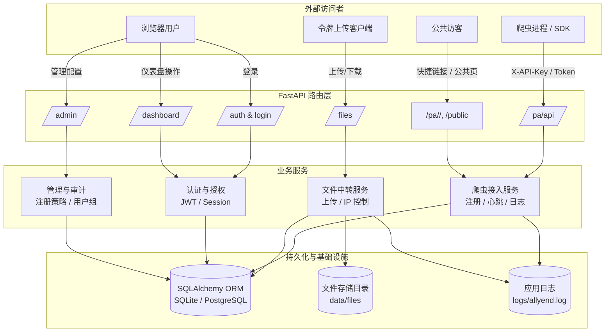

# AllYend

AllYend 是一个面向团队的爬虫监控与文件中转一体化平台，帮助数据团队以更低的运维成本统一管理爬虫任务、文件流转以及访问审计。

## 项目定位与目标

- **统一入口**：将爬虫 API、文件中转、后台管理集中在同一套 FastAPI 应用中，减少多系统切换的摩擦。
- **可观测性**：通过运行日志、心跳与访问日志，追踪爬虫与文件动作的上下文，便于快速定位问题。
- **安全可控**：支持分组、邀请码、API Key、文件令牌与 IP 白名单，满足团队内部与外部协作的权限控制需求。
- **可扩展**：基于 SQLAlchemy 与 Pydantic 构建的数据与配置层，易于迁移数据库、追加字段或引入新的业务能力。

## 架构总览



### 架构解读

- 路由层以 FastAPI 模块化拆分：`routers/auth.py` 处理登录注册、`routers/crawlers.py` 对接爬虫、`routers/files.py` 管理文件、`routers/dashboard.py` 和 `routers/admin.py` 提供页面与后台能力。
- 业务层通过依赖注入共享认证、数据库 Session 与配置，保持领域逻辑内聚，同时避免重复校验。
- 数据持久层默认使用 SQLite，可通过 `DATABASE_URL` 切换到 PostgreSQL/MySQL；文件流量落地到 `data/files/objects` 并写入文件访问日志。
- RotatingFileHandler 将运行日志写入 `logs/allyend.log`，便于与数据库内的业务流水形成互补。

## 核心能力概览

- **爬虫接入中心**：注册 → API Key → 心跳与运行日志 → 快捷匿名链接展示。
- **文件中转站**：用户网盘、令牌上传、匿名公共页、IP/CIDR 限制以及访问审计。
- **管理控制台**：注册策略、邀请码生命周期、分组与角色管理、文件访问追踪。
- **个性化仪表盘**：主题设定、公共空间展示、个人爬虫与 API Key 管理。

## 代码结构速览

| 模块 | 关键文件 | 职责 |
| ---- | ---- | ---- |
| 应用入口 | `app/main.py` | FastAPI 初始化、日志配置、路由挂载、启动钩子 |
| 配置与常量 | `app/config.py`、`app/constants.py` | .env 配置加载、角色/主题/默认组等常量 |
| 数据访问 | `app/database.py`、`app/models.py` | 数据库引擎、ORM 模型、迁移补丁、自举默认数据 |
| 认证与依赖 | `app/auth.py`、`app/dependencies.py` | 密码哈希、JWT/Session、依赖注入、当前用户校验 |
| 业务路由 | `app/routers/*.py` | 爬虫 API、文件接口、仪表盘、管理员与公共访问等业务逻辑 |
| 前端模板 | `app/templates/*.html`、`app/static/styles.css` | Jinja2 模板与静态资源，实现主题与后台界面 |
| SDK | `sdk/crawler_client.py` | 提供注册、心跳、运行、日志上报等 Python 客户端封装 |

## 快速开始

1. **初始化配置**
   ```bash
   copy .env.example .env  # Linux / Mac 使用 cp
   ```
   - 调整 `SECRET_KEY`、`ROOT_ADMIN_PASSWORD`、`DATABASE_URL` 等关键参数。
   - 首次启动时会根据 `ROOT_ADMIN_INVITE_CODE` 生成超级管理员账号。

2. **创建虚拟环境并安装依赖**
   ```bash
   python -m pip install -U uv
   uv venv
   uv sync
   ```

3. **启动开发服务**
   ```bash
   uv run uvicorn app.main:app --reload --host 0.0.0.0 --port 9093
   ```

4. **浏览器访问 `http://localhost:9093`**
   - 使用 `.env` 中配置的 root 管理员登录。
   - 在 `/admin` 控制台生成邀请码或调整注册策略。

> 生产环境建议：使用反向代理（Nginx/Caddy）提供 HTTPS，配合系统服务或容器守护进程运行。

## 典型使用流程

1. **管理员初始化**：登录后台 → 设置注册模式 → 创建用户组与邀请码 → 配置文件存储路径与日志目录。
2. **成员入驻**：成员使用邀请码注册，或管理员直接创建账户并分配分组与角色。
3. **爬虫接入**：
   - 在仪表盘创建 API Key。
   - 爬虫服务使用 SDK 或 REST API 注册自身，周期性上报心跳与运行日志。
   - 需要共享日志时，为指定爬虫或 API Key 生成快捷访问链接。
4. **文件流转**：
   - 成员登录后在 `/files` 上传/下载文件。
   - 跨团队协作通过生成文件令牌 (`/files/api/tokens`)，可选配置 IP 白名单。
   - 所有操作写入 `file_access_logs`，管理员可在后台审计。
5. **运维与监控**：
   - 通过仪表盘查看爬虫状态、公共空间与主题效果。
   - 下载日志或查询运行流水，定位异常请求来源。

## API / 功能速查

### 爬虫接入接口（`/pa/api`）

| 功能 | 方法 | 路径 |
| ---- | ---- | ---- |
| 注册 / 获取爬虫 ID | POST | `/pa/api/register` |
| 上报心跳 | POST | `/pa/api/{crawler_id}/heartbeat` |
| 运行开始 / 结束 | POST | `/pa/api/{crawler_id}/runs/start`<br>`/pa/api/{crawler_id}/runs/{run_id}/finish` |
| 日志上报 | POST | `/pa/api/{crawler_id}/logs` |
| 我的爬虫 / 日志 | GET | `/pa/api/me`<br>`/pa/api/me/logs` |
| 快捷链接管理 | GET/POST/DELETE | `/pa/api/links` |

- 所有上报接口会记录来源 IP 并写入 `log_entries`，便于追踪来源。
- 快捷链接 slug 最少 6 位，可指向爬虫或 API Key：
  ```bash
  curl -X POST /pa/api/links \
    -H "Content-Type: application/json" \
    -H "Authorization: Bearer <token>" \
    -d '{"target_type":"crawler","target_id":1,"slug":"allyend-demo"}'
  ```
  访问 `https://host/pa/allyend-demo/logs` 即可匿名查看日志（需开启 `allow_logs`）。

### 文件中转接口（`/files`）

- **用户网盘**：登录后访问 `/files`，可按私有 / 分组 / 公开设置可见性。
- **令牌操作**：
  - 创建：`POST /files/api/tokens`
  - 上传：`POST /files/api/tokens/{token}/up`
  - 列表：`GET /files/api/tokens/{token}`
- **访问限制**：令牌支持 `allowed_ips` 与 `allowed_cidrs`；所有访问都会写入 `file_access_logs`。
- **匿名访问**：`GET /files/<文件名>` 可获取最新版本，首页 `/files` 也会输出公开文件列表。

示例：
```bash
# 使用令牌上传并限制可见性为分组
curl -F "file=@data.csv" -F "visibility=group" https://host/files/<token>/up
```

### 管理控制台（`/admin`）

- 设置注册模式：开放 / 邀请 / 关闭。
- 创建、撤销邀请码（可设最大使用次数、过期时间、绑定分组）。
- 调整用户角色、分组、启用状态，保护超级管理员权限。
- 查看文件访问日志与系统配置。

## 数据模型摘要

- `users`：账户、角色、主题、自定义字段。
- `user_groups`：功能开关（爬虫 / 文件）与默认分组。
- `invite_codes`、`invite_usages`：邀请码与使用审计。
- `api_keys`、`crawlers`、`crawler_runs`、`log_entries`：爬虫生命周期与日志记录。
- `crawler_access_links`：快捷访问 slug 与开放策略。
- `file_entries`、`file_api_tokens`、`file_access_logs`：文件元数据、上传令牌、访问流水。
- `system_settings`：注册模式等动态配置项。

## SDK 快速示例

```python
from sdk.crawler_client import CrawlerClient

client = CrawlerClient(base_url="http://localhost:9093/pa", api_key="<你的APIKey>")
crawler = client.register_crawler("news_spider")
run = client.start_run(crawler_id=crawler["id"])
client.log(crawler_id=crawler["id"], level="INFO", message="启动成功", run_id=run["id"])
client.finish_run(crawler_id=crawler["id"], run_id=run["id"], status="success")
```

> 提示：上线前请将 `base_url` 指向生产环境的 `/pa` 前缀，并为运行日志设置合适的级别阈值。

## 配置清单（`.env`）

- `SITE_NAME`：品牌名称，将同步到模板与邮件内容。
- `ROOT_ADMIN_USERNAME` / `ROOT_ADMIN_PASSWORD` / `ROOT_ADMIN_INVITE_CODE`：超级管理员初始化参数。
- `DEFAULT_ADMIN_INVITE_CODE` / `DEFAULT_USER_INVITE_CODE`：预置邀请码（可选）。
- `ALLOW_DIRECT_SIGNUP`：是否允许无邀请码注册。
- `SECRET_KEY`、`ACCESS_TOKEN_EXPIRE_MINUTES`、`ALGORITHM`：JWT 安全参数。
- `DATABASE_URL`：数据库连接串，支持 SQLite/PostgreSQL/MySQL。
- `FILE_STORAGE_DIR`：文件存储目录（默认 `data/files`）。
- `LOG_DIR`：应用日志目录（默认 `logs`）。
- `SITE_ICP`：页脚备案信息（如不需要可留空）。

## 后续规划

- 指标看板与告警：整合 Prometheus / Webhook，增强异常检测。
- Webhook / 回调：爬虫事件触发外部流水线或通知。
- 更细粒度的文件标签、保留策略与下载签名。
- 分布式部署支持（消息队列、任务调度、对象存储适配）。

欢迎提交 Issue 或 Pull Request，一起让 AllYend 更稳、更好用。

