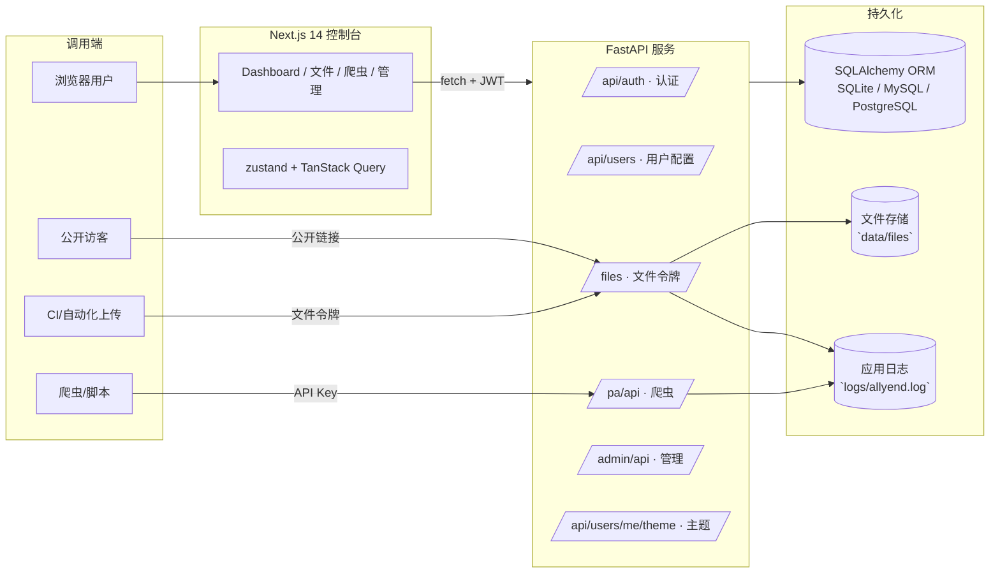

# AllYend 平台（v0.2.x）

AllYend 是一套集 **爬虫资产接入、运行监控、文件中转与访问审计** 于一体的团队协作平台。0.2 版本起仓库升级为前后端分离架构：后端沿用 FastAPI 单体服务，前端迁移至 Next.js 14，配套 Python SDK、令牌安全与日志闭环能力。

## 核心亮点
- **前后端分离的全栈方案**：FastAPI + SQLAlchemy 承载业务与数据，Next.js 14 + React 18 负责交互界面，天然适配前后端独立部署。
- **端到端安全防护**：JWT 登录、邀请码、多角色分组、API Key、公私域文件令牌、IP/CIDR 白名单与访问审计统一入口可管可控。
- **可观测性内建**：爬虫心跳、运行批次、日志级别、文件访问流水全部入库并写入轮转日志，方便告警追踪与问题复盘。
- **开发者体验优先**：`uv` 管理 Python 依赖、`pnpm` 管理前端；TanStack Query、Zod、zustand 等现代工具让状态管理与表单校验简单可靠。

## 仓库结构
| 路径 | 说明 |
| --- | --- |
| `app/` | FastAPI 应用（配置、路由、模型、模板、静态资源） |
| `app/routers/` | 业务分域路由：认证 `auth.py`、爬虫 `crawlers.py`、文件 `files.py`、管理 `admin.py`、仪表盘 `dashboard.py` |
| `sdk/crawler_client.py` | Python SDK，封装爬虫注册、心跳、日志、运行批次等 API |
| `frontend/` | Next.js 14 前端工程（pnpm、Tailwind、shadcn/ui、TanStack Query 等） |
| `test/` | Pytest 用例（认证与文件模块示例） |
| `.env.example` / `.env` | 后端环境配置模板与实际环境变量 |
| `frontend/.env.example` | 前端环境变量模板 |
| `logs/` | 默认日志输出目录（`RotatingFileHandler` 自动轮转） |
| `data/` | 默认 SQLite 与文件存储目录（被 `.gitignore` 忽略，部署时请挂载持久化卷） |
| `环境安装.md` | 记录本地环境初始化步骤（Node、pnpm、uv 等） |

## 系统架构概览


## 运行环境要求
- Python ≥ 3.10（推荐 3.12），配套 [uv](https://github.com/astral-sh/uv) 管理依赖与虚拟环境。
- Node.js 22.x（Active LTS）与 pnpm 9.x；Windows 建议 `scoop install nodejs-lts pnpm`，macOS/Linux 可用 `nvm use 22 && corepack enable`。
- SQLite 默认即可，生产可切换 MySQL/PostgreSQL；文件存储目录需具备读写权限。

## 快速上手
1. **克隆仓库并准备配置**
   ```bash
   git clone <repo-url>
   cd codetets
   copy .env.example .env      # macOS/Linux 改用 cp
   copy frontend/.env.example frontend/.env
   ```
   按需修改 `.env`（密钥、数据库、端口、邀请策略等）与 `frontend/.env`（后端 API 地址）。

2. **安装后端依赖**
   ```bash
   python -m pip install -U uv
   uv venv
   uv sync
   ```

3. **运行后端服务**
   ```bash
   uv run uvicorn app.main:get_app --reload --host 0.0.0.0 --port 9093
   ```
   首次启动会自动建表、创建默认用户组与超级管理员。日志写入 `logs/allyend.log`。

4. **安装并启动前端**
   ```bash
   cd frontend
   pnpm install
   pnpm dev --port 3000
   ```
   浏览器访问 `http://localhost:3000`，登录入口 `/login`，控制台 `/dashboard`。

5. **首次体验建议**
   - 使用 `.env` 中的超级管理员账号登录，访问 `/admin` 配置注册模式与邀请码。
   - 在“令牌管理”页面生成文件令牌，验证上传/下载与审计日志。
   - 通过 Python SDK 或 REST 客户端调用 `/pa/api/register` 登记爬虫，观察心跳与运行日志。

## 配置项速览
### 后端 `.env`
| 变量 | 说明 | 默认值 |
| --- | --- | --- |
| `SITE_NAME` | 站点名称（模板与邮件中展示） | `AllYend` |
| `SECRET_KEY` | JWT 加密密钥，生产务必改为随机值 | `please_change_me` |
| `ACCESS_TOKEN_EXPIRE_MINUTES` | 登录令牌有效期（分钟） | `120` |
| `DATABASE_URL` | SQLAlchemy 连接串，支持 SQLite/MySQL/PostgreSQL | `sqlite:///./data/app.db` |
| `ROOT_ADMIN_USERNAME` / `ROOT_ADMIN_PASSWORD` | 首次启动自动创建的超级管理员账号 | `allroot` / `please_set_a_strong_password` |
| `ROOT_ADMIN_INVITE_CODE` / `DEFAULT_ADMIN_INVITE_CODE` / `DEFAULT_USER_INVITE_CODE` | 预置邀请码，控制注册流转 | `ALLYEND-ROOT` 等 |
| `ALLOW_DIRECT_SIGNUP` | 是否允许免邀请码注册 | `true` |
| `FILE_STORAGE_DIR` | 文件存储根目录 | `data/files` |
| `LOG_DIR` | 日志目录 | `logs` |
| `FRONTEND_ORIGINS` | 允许跨域访问的前端地址（逗号分隔） | `http://localhost:3000` |
| `SITE_ICP` | 备案号展示（可留空） | 空 |

### 前端 `frontend/.env`
| 变量 | 说明 | 默认值 |
| --- | --- | --- |
| `NEXT_PUBLIC_API_BASE_URL` | FastAPI 服务对外地址 | `http://localhost:9093` |
| `NEXT_PUBLIC_APP_BASE_URL` | 前端自身地址，用于拼接跳转链接 | `http://localhost:3000` |

## 核心功能模块
### 认证与权限
- 表单登录、注册与登出同时提供 SSR 页面与 REST API，支持邀请制开关与邀请码用途统计。
- 用户归属在 `UserGroup`，可按组开启/关闭爬虫与文件功能；角色涵盖普通用户、管理员、超级管理员。
- API Key 管理支持命名、描述、启停、公开共享与本地编号，本地编号便于业务系统引用。
- 主题设定（颜色、暗色模式）通过 `/api/users/me/theme` 接口持久化，前后端共享预设。

### 爬虫监控与快捷分享
- `/pa/api/register` 登记爬虫，平台自动分配本地编号与 API Key 关联；`/pa/api/{id}/heartbeat` 上报心跳。
- 运行批次：`/pa/api/{id}/runs/start`/`finish` 记录状态与来源 IP，配套日志级别（INFO/WARN/ERROR 等）过滤。
- `/pa/api/links` 创建快捷访问链接，可指向爬虫或 API Key；公开站点 `/pa/{slug}` 与 `/pa/{slug}/api/logs` 支持外部查看。
- `/pa/api/me` 返回当前用户的爬虫资产，提供 PATCH 更新（名称、公开状态、描述等）。

### 文件中转与访问审计
- 私有“网盘”接口 `/files/me` 系列提供列表、上传、更新、删除；支持文件名去重别名与多版本访问。
- 令牌上传 `/files/{token}/up` 与下载 `/files/{identifier}` 覆盖 CI/自动化场景，支持 IP/IP 段白名单与失效开关。
- 审计 `/files/api/logs` 记录每次上传/下载的发起者、来源 IP、耗时、状态，便于追责。
- 公共空间 `/files`（Jinja 页面）与前端控制台联动，可快速定位文件访问路径。

### 管理控制台
- `/admin/api/users` 管理用户启停、角色、所属分组；防护超级管理员只能由同级调整。
- `/admin/api/invites` 生成/撤销邀请码，可设置过期时间与最大次数。
- `/admin/api/settings/registration` 切换注册模式：开放、邀请码、关闭。
- 管理模板页面提供注册策略概览与常用入口，便于快速运维。

### 前端控制台（Next.js 14）
- 使用 App Router + Server Actions，公共入口页介绍平台能力，受保护路由 `(protected)` 聚合仪表盘、爬虫、文件、管理页面。
- `@/lib/api` 封装 fetch + 错误处理，TanStack Query 负责缓存与状态刷新，zustand 管理令牌与用户资料。
- 支持暗色/亮色切换、shadcn/ui 组件库快速构建 UI、Tailwind CSS 统一样式策略。
- Playwright/Vitest 骨架已就绪，后续可覆盖关键流程（登录→上传→主题修改）。

### Python SDK 快速示例
```python
from sdk.crawler_client import CrawlerClient

client = CrawlerClient(base_url="http://localhost:9093", api_key="<平台生成的 key>")
spider = client.register_crawler("news-spider")
run = client.start_run(crawler_id=spider["id"])
client.log(crawler_id=spider["id"], run_id=run["id"], level="INFO", message="启动完成")
client.heartbeat(crawler_id=spider["id"])
# 运行结束后上报状态，可选值 success / failed / warning
client.finish_run(crawler_id=spider["id"], run_id=run["id"], status="success")
```

## API 快速索引
> 仅列出核心 REST 接口，更多详情请参考 `app/routers/**` 源码或自建 Swagger 文档。

### 认证与用户
| 方法 | 路径 | 说明 |
| --- | --- | --- |
| `POST` | `/api/auth/register` | JSON 注册（支持邀请码），返回 JWT |
| `POST` | `/api/auth/login` | JSON 登录，返回 JWT |
| `GET` | `/api/users/me` | 当前登录用户信息 |
| `GET` | `/api/keys` | 列出当前用户的 API Key |
| `POST` | `/api/keys` | 生成新的 API Key |
| `PATCH` | `/api/keys/{key_id}` | 更新名称、描述、启用状态、公开状态 |
| `DELETE` | `/api/keys/{key_id}` | 删除 API Key |
| `GET` | `/api/public/keys` | 查询所有公开的 API Key（无需认证） |
| `GET/PATCH` | `/api/users/me/theme` | 获取/更新个人主题设定 |

### 爬虫与公共链接
| 方法 | 路径 | 说明 |
| --- | --- | --- |
| `POST` | `/pa/api/register` | 登记爬虫实例（需要 API Key） |
| `POST` | `/pa/api/{crawler_id}/heartbeat` | 上报心跳时间与来源 IP |
| `POST` | `/pa/api/{crawler_id}/runs/start` | 创建运行批次 |
| `POST` | `/pa/api/{crawler_id}/runs/{run_id}/finish` | 结束运行批次并标记状态 |
| `POST` | `/pa/api/{crawler_id}/logs` | 推送运行日志，自动计算级别 |
| `GET` | `/pa/api/me` | 查询当前用户所有爬虫 |
| `PATCH` | `/pa/api/me/{crawler_id}` | 更新名称、公开状态等属性 |
| `GET` | `/pa/api/me/{crawler_id}/runs` | 获取指定爬虫运行历史 |
| `GET` | `/pa/api/me/{crawler_id}/logs` | 获取指定爬虫日志列表 |
| `GET` | `/pa/api/me/logs` | 汇总当前用户所有爬虫日志 |
| `POST` | `/pa/api/links` | 创建快捷访问链接（爬虫或 API Key） |
| `GET` | `/pa/{slug}` | 公共详情页面（Jinja 模板） |
| `GET` | `/pa/{slug}/api` | 公共链接摘要（JSON） |
| `GET` | `/pa/{slug}/api/logs` | 公共日志查询（支持级别、日期过滤） |

### 文件服务
| 方法 | 路径 | 说明 |
| --- | --- | --- |
| `GET` | `/files/me` | 当前用户文件列表 |
| `POST` | `/files/me/up` | 上传文件（多部分表单，字段名 `file`） |
| `PATCH` | `/files/me/{file_id}` | 编辑文件元数据（名称、可见性、描述等） |
| `DELETE` | `/files/me/{file_id}` | 删除文件（软删除） |
| `GET` | `/files/{file_id}/download` | 根据 ID 强制下载文件 |
| `POST` | `/files/tokens` | 创建文件上传令牌（支持 IP 白名单、描述、启停） |
| `GET` | `/files/tokens` | 列出当前用户所有令牌 |
| `PATCH` | `/files/tokens/{token_id}` | 修改令牌状态与约束 |
| `POST` | `/files/{token_value}/up` | 通过上传令牌上传文件 |
| `GET` | `/files/{identifier}` | 通过令牌或别名获取文件/列表，`?download=1` 可强制下载 |
| `GET` | `/files/api/logs` | 查询文件访问审计日志 |

### 管理能力
| 方法 | 路径 | 说明 |
| --- | --- | --- |
| `GET` | `/admin/api/users` | 管理员列出所有用户 |
| `PATCH` | `/admin/api/users/{user_id}` | 更新角色、启用状态、分组 |
| `GET` | `/admin/api/groups` | 列出用户组及功能开关 |
| `GET` | `/admin/api/invites` | 邀请码列表 |
| `POST` | `/admin/api/invites` | 创建邀请码（可设过期与次数） |
| `DELETE` | `/admin/api/invites/{invite_id}` | 删除邀请码 |
| `GET` | `/admin/api/settings` | 查看注册模式等系统设置 |
| `PATCH` | `/admin/api/settings/registration` | 切换注册模式（open / invite / closed） |

## 开发与测试
- **后端**
  - 运行单元测试：`uv run pytest`
  - 推荐使用内存 SQLite（pytest 默认配置），如需覆盖文件上传场景请确保临时目录可写。
  - 可结合 `LOG_LEVEL=DEBUG` 或 VSCode 调试器观察请求流。
- **前端**
  - 语法检查：`pnpm lint`（ESLint + Stylelint）
  - 类型检查：`pnpm typecheck`
  - 单元测试：`pnpm test`
  - 端到端测试：`pnpm test:ui`（Playwright，需先执行 `pnpm playwright install`）
  - 提交前 Husky + lint-staged 会自动运行必要检查。

## 部署建议
- 使用 `uv pip compile` 或 `uv export` 固化后端依赖，在部署环境运行 `uv run uvicorn app.main:get_app`（建议加上 `--workers`、`--proxy-headers` 等参数）。
- 前端执行 `pnpm build` 后通过 `pnpm start` 或容器方式运行，也可选择静态导出 + 边缘网络托管。
- 推荐通过 Nginx/Caddy 反向代理，将 `/` 指向前端，`/api`、`/pa`、`/files` 等路由代理到 FastAPI；开启 HTTPS 与压缩。
- 定期备份 `data/` 与 `logs/` 目录，结合 logrotate 或集中日志系统处理 `allyend.log`。

## 更新重点（2025-09）
- 新增 Next.js 14 控制台，提供登录、仪表盘、爬虫与文件管理的现代化交互体验。
- 完善 TanStack Query + zustand 状态管理与 API 封装，支持 Token 持久化与统一错误提示。
- 扩展爬虫接口：新增批次结束状态、公共快捷链接 API、日志级别归一化与来源 IP 记录。
- 文件服务补充别名去重、强制下载、令牌启停/IP 限制、访问审计分页等能力。
- 管理后台开放注册模式切换与分组功能开关，默认引导超级管理员初始化站点。

## 相关文档与拓展
- 前端开发细节参考 `frontend/README.md`。
- 环境初始化步骤记录在 `环境安装.md`，如需新增依赖请同步更新。
- SDK 更多用法可查阅 `sdk/crawler_client.py` 内联注释与 docstring。
- 若计划扩展 API，可结合 FastAPI 的 `openapi.json` 接口生成文档或引入 Swagger UI。

请按需提交 Issue 或 PR，一起打磨 AllYend，使其在数据采集团队中发挥更大价值。
