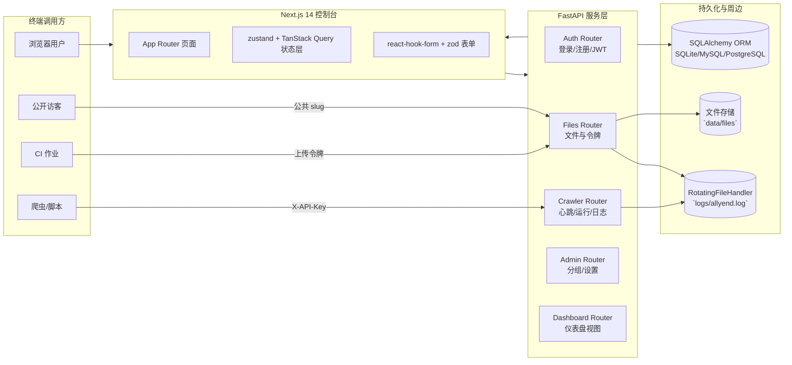
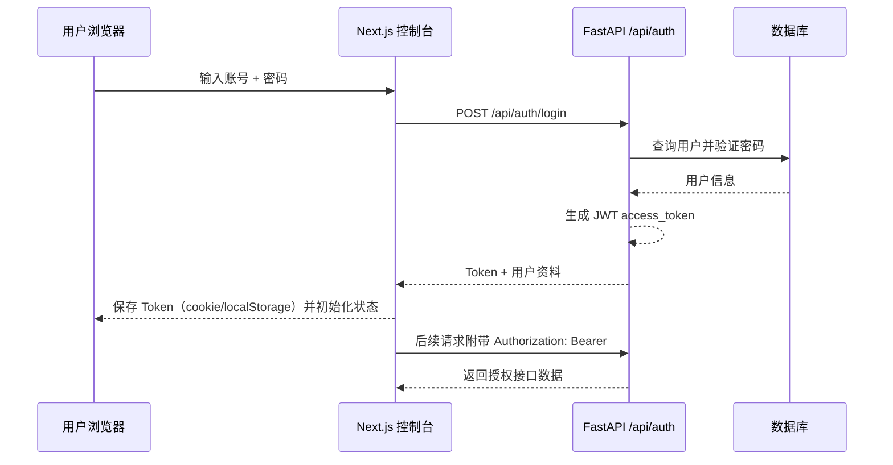

# AllYend 平台 v0.2.x

> FastAPI + Next.js 的一站式采集资产运营平台，覆盖授权、安全、审计与可观测全链路。

## 目录
- [1. 项目总览](#1-项目总览)
- [2. 架构蓝图](#2-架构蓝图)
- [3. 核心业务流程](#3-核心业务流程)
- [4. 环境准备](#4-环境准备)
- [5. 快速启动](#5-快速启动)
- [6. 配置清单](#6-配置清单)
- [7. 后端服务说明](#7-后端服务说明)
- [8. 前端应用说明](#8-前端应用说明)
- [9. SDK 与自动化接入](#9-sdk-与自动化接入)
- [10. 测试与质量保障](#10-测试与质量保障)
- [11. 部署与运维建议](#11-部署与运维建议)
- [12. 安全与合规实践](#12-安全与合规实践)
- [13. 路线图与扩展方向](#13-路线图与扩展方向)
- [14. 相关文档](#14-相关文档)

## 1. 项目总览

### TL;DR
- 面向数据采集团队，提供爬虫调度、文件中转、访问审计、权限控制的一体化平台。
- 前端使用 Next.js 14 App Router，后端采用 FastAPI + SQLAlchemy 单体，前后端可独立部署。
- 内置 API Key、上传令牌、公开链接等机制，既能服务自动化脚本也能满足人工协作。
- 默认集成日志轮转、心跳监控、批次追踪，便于快速定位线上问题。

### 核心能力
- **爬虫资产生命周期**：注册、心跳、运行批次、日志、快捷分享链接全链路打通。
- **文件安全分发**：上传令牌、公开/私有/分组可见性、访问审计与下载统计。
- **团队协作治理**：邀请码注册、分组权限、管理员控制面板、个人主题配置。
- **可观测与审计**：RotatingFileHandler 日志、数据库存量指标、前端仪表盘实时刷新。

### 适用场景
- 多人维护的采集脚本或机器人，需要统一管理 API Key、运行状态与告警链路。
- 需要在团队或外部合作方之间安全地中转文件，保留访问留痕。
- 希望在现有企业内部已有 IAM 之外快速搭建轻量级协作平台。

### 已知限制
- API Key 默认以明文保存在数据库，生产环境应考虑哈希或加密存储。
- 当前使用 SQLAlchemy 自动建表，尚未接入 Alembic 等迁移工具（生产部署需手动维护）。
- 平台暂未内置消息推送/告警通道，可结合现有监控系统扩展。
- 前端页面仍在逐步对接所有 API，部分功能存在占位或示例数据。

## 2. 架构蓝图

### 技术栈总览
| 层级 | 技术选型 | 说明 |
| --- | --- | --- |
| 前端 | Next.js 14、React 18.3、TypeScript 5、Tailwind CSS、shadcn/ui、TanStack Query、zustand、react-hook-form、zod | 现代化单页体验，App Router 支持流式渲染与服务端组件。 |
| 后端 | FastAPI、SQLAlchemy 2、Pydantic v2、Uvicorn、PyJWT、Passlib | 高性能异步 API 服务，统一 Schema 与依赖注入。 |
| 数据与存储 | SQLite 默认、兼容 MySQL/PostgreSQL、文件系统存储、RotatingFileHandler 日志 | `data/` 目录用于数据库与文件，`logs/` 记录运行日志。 |
| 工程化 | uv、pnpm、Vitest、Playwright、Docker Compose、Husky + lint-staged | 覆盖依赖管理、测试、预提交检查与容器化部署。 |

### 系统组件拓扑


### 模块分层与职责
| 模块 | 路径 | 职责要点 |
| --- | --- | --- |
| `app/main.py` | FastAPI 入口，配置日志、CORS、静态资源与路由挂载。 |
| `app/routers/` | 业务域路由：`auth`（认证与钥匙）、`crawlers`（爬虫 API + 公共入口）、`files`（文件/令牌/审计）、`admin`（分组与系统设置）、`dashboard`（仪表盘视图）。 |
| `app/models.py` | SQLAlchemy ORM 定义。覆盖用户、API Key、爬虫、运行批次、文件条目、访问日志等实体。 |
| `app/schemas.py` | Pydantic 模型，统一请求/响应 Schema。 |
| `frontend/src/` | Next.js 源码，按 features + app page 分层，结合 shadcn/ui 打造组件体系。 |
| `sdk/crawler_client.py` | Python SDK，封装爬虫注册、心跳、运行、日志与 print 捕获能力。 |
| `test/` | Pytest 用例，覆盖认证流程与文件工具逻辑。 |
| `docker-compose.yaml` | 一键启动前后端的容器编排示例。 |

## 3. 核心业务流程

### 3.1 登录与授权序列


### 3.2 爬虫生命周期
```mermaid
flowchart TD
    Start([开始接入])
    Register[注册爬虫<br/>POST /pa/api/register]
    Heartbeat[心跳上报<br/>POST /{id}/heartbeat]
    RunStart[创建运行批次<br/>POST /runs/start]
    Log[推送运行日志<br/>POST /logs]
    RunFinish[结束批次<br/>POST /runs/{id}/finish]
    PublicLink[可选：创建分享链接<br/>POST /pa/api/links]
    Dashboard[控制台仪表盘可视化]

    Start --> Register --> Heartbeat --> RunStart --> Log --> RunFinish --> Dashboard
    RunStart --> PublicLink
    Log --> Dashboard
```

### 3.3 文件令牌与访问闭环
```mermaid
flowchart TD
    Owner[资源所有者]
    CreateToken[控制台生成上传/下载令牌]
    Distribute[下发令牌给合作方]
    Upload[持令牌上传文件<br/>POST /files/{token}/up]
    Store[写入 data/files 并生成 FileEntry]
    Approve[管理可见性/描述<br/>PATCH /files/me/{id}]
    Share[公开或授权访问<br/>GET /files/{identifier}]
    Audit[查询访问审计<br/>GET /files/api/logs]

    Owner --> CreateToken --> Distribute --> Upload --> Store --> Approve --> Share --> Audit
```

## 4. 环境准备

- Python ≥ 3.10（推荐 3.12）并安装 [uv](https://github.com/astral-sh/uv) 管理虚拟环境与依赖。
- Node.js 22.x（Active LTS）与 pnpm 9.x。Windows 建议 `scoop install nodejs-lts pnpm`，macOS/Linux 使用 `nvm use 22 && corepack enable`。
- 可使用 SQLite 作为开发数据库；生产建议切换 MySQL/PostgreSQL 并配置持久化卷。
- 需要 Git、Docker（可选）以及基本的编译工具链。

### 仓库结构速览
```text
.
├── app/                # FastAPI 服务端
├── frontend/           # Next.js 14 控制台
├── sdk/                # Python SDK
├── test/               # Pytest 用例
├── data/               # 默认数据库/文件存储（挂载卷）
├── logs/               # 应用轮转日志
├── .env.example        # 后端环境变量模板
├── frontend/.env.example
├── docker-compose.yaml # 容器编排示例
└── README.md           # 本文档
```

## 5. 快速启动

### 5.1 本地开发（推荐）
```bash
git clone <repo-url> allyend
cd allyend

# 初始化配置
copy .env.example .env
copy frontend/.env.example frontend/.env  # macOS/Linux 使用 cp

# 后端依赖
python -m pip install -U uv
uv venv
uv sync

# 前端依赖
cd frontend
pnpm install
cd ..
```

```bash
# 启动 FastAPI（热重载）
uv run uvicorn app.main:get_app --reload --host 0.0.0.0 --port 9093

# 另开终端启动 Next.js
cd frontend
pnpm dev
```

访问 `http://localhost:3000` 登录控制台（默认根管理员邀请码 `ALLYEND-ROOT`）。

### 5.2 Docker Compose 快速体验
```bash
# 首次构建镜像
docker compose build

# 后台运行
docker compose up -d

# 查看日志
docker compose logs -f backend
docker compose logs -f frontend
```
容器会自动挂载当前目录的 `data/` 与 `logs/`，停用后数据仍然保留。

### 5.3 常用脚本
- `uv run pytest`：运行后端测试。
- `pnpm lint` / `pnpm typecheck`：前端静态检查。
- `pnpm test` / `pnpm test:ui`：单元测试与端到端测试。
- `pnpm build && pnpm start`：生产模式验证。

## 6. 配置清单

### 后端 `.env` 核心项
| 变量 | 作用 | 默认值 | 备注 |
| --- | --- | --- | --- |
| `SITE_NAME` | 平台名称 | `AllYend` | 影响模板与前端显示。 |
| `SECRET_KEY` | JWT 签名密钥 | `please_change_me_to_a_random_string` | 生产环境务必替换。 |
| `ACCESS_TOKEN_EXPIRE_MINUTES` | Token 过期时间 | `120` | 单位分钟。 |
| `DATABASE_URL` | SQLAlchemy 数据源 | `sqlite:///./data/app.db` | 可切换 MySQL/PostgreSQL。 |
| `FRONTEND_ORIGINS` | 允许的 CORS 来源 | `http://localhost:3000` | 支持逗号分隔或 JSON 数组。 |
| `ROOT_ADMIN_USERNAME` / `ROOT_ADMIN_PASSWORD` | 首个超级管理员凭据 | `allroot` / `please_set_a_strong_password` | 启动时自动创建。 |
| `ALLOW_DIRECT_SIGNUP` | 是否允许自由注册 | `true` | 设为 `false` 时需邀请码。 |
| `FILE_STORAGE_DIR` | 文件物理存储路径 | `data/files` | 需具备读写权限。 |
| `LOG_DIR` | 日志输出目录 | `logs` | 内含 `allyend.log`。 |

### 前端 `frontend/.env`
| 变量 | 说明 | 默认值 |
| --- | --- | --- |
| `NEXT_PUBLIC_API_BASE_URL` | 后端 API 地址 | `http://localhost:9093` |
| `NEXT_PUBLIC_APP_BASE_URL` | 前端站点地址 | `http://localhost:3000` |

### Docker Compose 参数
| 变量 | 说明 | 默认值 |
| --- | --- | --- |
| `DOCKER_BACKEND_PORT` / `DOCKER_FRONTEND_PORT` | 宿主机暴露端口 | `9093` / `3000` |
| `DOCKER_DATA_DIR` / `DOCKER_LOG_DIR` | 数据/日志挂载路径 | `./data` / `./logs` |
| `NEXT_PUBLIC_API_BASE_URL` | 构建时注入的后端地址 | `http://localhost:9093` |

## 7. 后端服务说明

### 架构特点
- FastAPI + Pydantic v2 保障类型安全，依赖注入集中在 `app/dependencies.py`。
- SQLAlchemy 2.0 ORM 建模，复用 `Base` 与 `SessionLocal`，支持多数据库。
- JWT 鉴权与基于依赖的 RBAC 控制，结合邀请码与分组能力。
- RotatingFileHandler + 数据库审计表提供可追溯日志。

### 目录导览
| 位置 | 内容 |
| --- | --- |
| `app/auth.py` | 密码哈希、JWT 生成、依赖工具。 |
| `app/database.py` | Session 工厂、基础模型、启动时初始化与默认数据。 |
| `app/constants.py` | 角色、主题、日志级别等常量。 |
| `app/utils/` | 时间处理、文件工具、校验函数。 |
| `app/templates/` | 登录、公共页面的 Jinja2 模板。 |
| `app/static/` | 公共资源、风格文件。 |

### 数据模型摘要
| 实体 | 说明 |
| --- | --- |
| `UserGroup` | 用户分组，定义功能开关与默认组。 |
| `User` | 平台用户，支持邀请链路、分组、角色。 |
| `APIKey` | 接入凭证，包含启用状态、公开标记、最后使用信息。 |
| `Crawler` / `CrawlerRun` / `LogEntry` | 爬虫实例、运行批次与日志明细。 |
| `CrawlerAccessLink` | 快捷分享链接，支持公开爬虫或 API Key。 |
| `FileAPIToken` | 上传令牌，支持 IP/CIDR 限制、启停控制。 |
| `FileEntry` | 文件元数据，记录存储路径、可见性、下载统计。 |
| `FileAccessLog` | 文件访问审计，追踪上传/下载/删除行为。 |
| `InviteCode` / `InviteUsage` | 邀请码与使用记录。 |
| `SystemSetting` | 全局设置（如注册模式）。 |

### API 分组概览
- `/api/auth/*`：登录、注册、个人资料、API Key 管理。
- `/api/users/me/theme`：主题偏好保存。
- `/pa/api/*`：爬虫注册、心跳、运行、日志及公共链接。
- `/files/*`：文件上传、下载、令牌操作与日志。
- `/admin/api/*`：用户与分组管理、站点级配置。
- `/dashboard/*`：仪表盘数据源。

## 8. 前端应用说明

### 核心设计
- App Router + Server Components，结合 `layout.tsx` 管理认证重定向与全局状态。
- `zustand` 存储登录态与 UI 偏好，`TanStack Query` 处理 API 数据缓存与错误提示。
- `react-hook-form` + `zod` 提供一致的表单体验，配合 shadcn/ui 自定义组件库。
- 提供登录页、仪表盘、爬虫管理、文件管理、系统设置等视图骨架。

### 目录导览
| 目录 | 内容 |
| --- | --- |
| `src/app/` | 页面与路由（`page.tsx` 登录页、`dashboard` 等子路由）。 |
| `src/features/` | 业务模块（如 crawlers、files、admin）的 UI 与逻辑。 |
| `src/components/` | 布局、导航、表单控件与通用组件。 |
| `src/lib/` | API 客户端、工具方法、fetch 封装。 |
| `src/store/` | zustand slices。 |
| `src/hooks/` | 自定义 Hooks（鉴权、主题等）。 |
| `src/ui/` | shadcn/ui 生成的基础组件。 |

### 状态与网络策略
- Axios/Fetch 封装统一注入 Token 与错误处理，集中于 `src/lib`。
- Query Keys 以业务域划分，便于乐观更新与缓存失效。
- Toast 与对话框集中在 `components/providers` 管理，支持全局调用。

## 9. SDK 与自动化接入

### 快速上手
```python
from sdk.crawler_client import CrawlerClient

client = CrawlerClient(base_url="http://localhost:9093", api_key="<你的 API Key>")
crawler = client.register_crawler("news_spider")
run = client.start_run(crawler_id=crawler["id"])

client.log(crawler_id=crawler["id"], level="INFO", message="启动完成", run_id=run["id"])
client.heartbeat(crawler_id=crawler["id"])

with client.capture_print(crawler_id=crawler["id"], run_id=run["id"], default_level="INFO"):
    print("这条信息会同步到平台日志")
client.finish_run(crawler_id=crawler["id"], run_id=run["id"], status="success")
```

### 能力摘要
| 方法 | 说明 |
| --- | --- |
| `register_crawler(name)` | 初始化爬虫实例，返回 ID/slug。 |
| `heartbeat(crawler_id)` | 更新最后心跳时间与 IP。 |
| `start_run(crawler_id)` / `finish_run(...)` | 管理运行批次状态。 |
| `log(...)` | 写入运行日志，支持级别与 run 关联。 |
| `printer()` / `capture_print()` | 将脚本中的输出镜像到平台日志。 |

更多细节可阅读 `sdk/crawler_client.py` 内联注释。

## 10. 测试与质量保障

| 范围 | 命令 | 说明 |
| --- | --- | --- |
| 后端单元测试 | `uv run pytest` | 使用内存 SQLite，覆盖认证与文件工具。 |
| 前端类型检查 | `pnpm typecheck` | TypeScript 严格模式。 |
| 前端语法/样式 | `pnpm lint` | ESLint 9 + Stylelint。 |
| 前端单元测试 | `pnpm test` | Vitest（可结合 jsdom）。 |
| 前端 E2E | `pnpm test:ui` | Playwright，首次运行需 `pnpm playwright install`。 |
| 提交前检查 | Husky + lint-staged | 自动执行格式化与 lint。 |

建议在 CI 中按照“类型检查 → 单元测试 → E2E”顺序执行。

## 11. 部署与运维建议

- **容器化部署**：使用 `Dockerfile.backend` + `frontend/Dockerfile` 打包，建议在 Compose/Swarm/Kubernetes 中分别部署，前端可托管在 CDN/边缘节点。
- **反向代理**：使用 Nginx / Caddy，将 `/api`、`/pa`、`/files` 等路由转发至后端，前端托管于 `/`。务必启用 HTTPS 和 HTTP/2。
- **日志与监控**：`logs/allyend.log` 已轮转，建议同步至集中日志平台（ELK、Loki）。爬虫心跳可结合 Prometheus 自定义 Exporter。
- **备份策略**：定期备份 `data/` 与数据库，必要时改用对象存储（S3/OSS）存放文件，并在 `.env` 中配置路径。
- **扩展配置**：生产环境建议接入 Alembic 维护数据迁移，启用 WAF 或网关限制高风险接口访问。

## 12. 安全与合规实践

- JWT 长度与过期时间可按需调整，推荐结合 HTTPS 与 HttpOnly Cookie。
- API Key 支持启停与公开标记，可在管理后台强化审批流程。
- 上传令牌支持 IP/CIDR 白名单，结合文件访问日志可审计异常。
- 对外公开页面（`/pa/{slug}`）可配置 CDN 缓存，避免源站压力。
- 建议在生产环境启用对象存储与防病毒扫描，满足合规要求。

## 13. 路线图与扩展方向

- ✅ 完成前后端分离与核心 API。
- ⏳ 计划中：前端对接全部业务接口、完善状态管理与表单校验。
- ⏳ 引入 Alembic 迁移与种子数据脚本，保障版本升级。
- ⏳ 增加 Webhook/消息推送，便于自动化告警。
- ⏳ 扩展多租户能力与细粒度权限控制。

欢迎通过 Issue/PR 贡献想法，一同完善 AllYend。

## 14. 相关文档

- `frontend/README.md`：前端开发说明。
- `sdk/crawler_client.py`：Python SDK 注释与示例。
- `docker-compose.yaml`：容器化部署参考。
- `test/`：后端测试用例。
- `gorai.md`：历史讨论与需求背景。

---

如在使用过程中遇到问题，欢迎提交 Issue 或直接交流，共建更稳定易用的数据采集协作平台。
